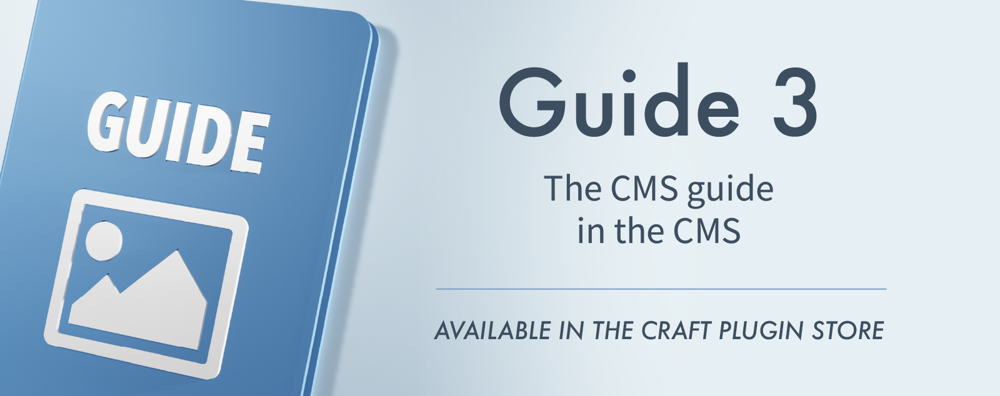

# **Work in Progress** Guide 3 is in development, but it will be released soon! If you would like to test out this version, please consider this a public Alpha until this message disappears. [Here is a preview of the docs for Guide 3.](https://3-x--guide-docs.netlify.app)



Craft CMS is intuitive. Marketing plans and organizational workflows—not so much. Guide lets you create a user manual throughout Craft CMS so clients don‘t need to go far to get the answers they need.

Guide was built to be a CMS manual, but Guide 3 is also a quick way to create widgets and unique Craft CP pages, without the use of a custom module or knowledge of PHP.

## Guide 3 for Craft CMS 3


## Requirements

- This plugin requires Craft CMS 3.7 or later.
- An evergreen browser that support CSS `aspect-ratio`.

## Installation

To install the plugin, you can find it in the [Craft Plugin Store](https://plugins.craftcms.com/guide), or follow these instructions.

1. Open your terminal and go to your Craft project:

    ```
    cd /path/to/project
    ```

2. Then tell Composer to load the plugin:

    ```
    composer require wbrowar/guide
    ```

3. In the Control Panel, go to Settings → Plugins and click the “Install” button for Guide.


## Setup

1. Visit the Guide settings page to configure a couple of setup options. The `Template Path` setting is required for guides to be displayed. The `Asset Volume` setting is recommended when screenshots and other images are used in your guide content.
2. Create your guides using the built-in editor or by selecting templates added to your Guide Template Path.
3. Use the Organizer to place your guides around the Craft CMS Control Panel.

---

## Documentation

[Documenation for Guide and Craft Guide Templates can be found here.](https://guide.wbrowar.com)

---

Brought to you by [Will Browar](https://wbrowar.com)

Here are some great open source projects that were used to help create this plugin:
- [DDEV Local](https://ddev.readthedocs.io/)
- [Nuxt.js](https://nuxtjs.org)
- [Tailwind CSS](https://tailwindcss.com)
- [Vite.js](https://vitejs.dev)
- [Vue.js](https://vuejs.org)

Thanks to the maintainers for doing what you do to make things like this possible. 💚
